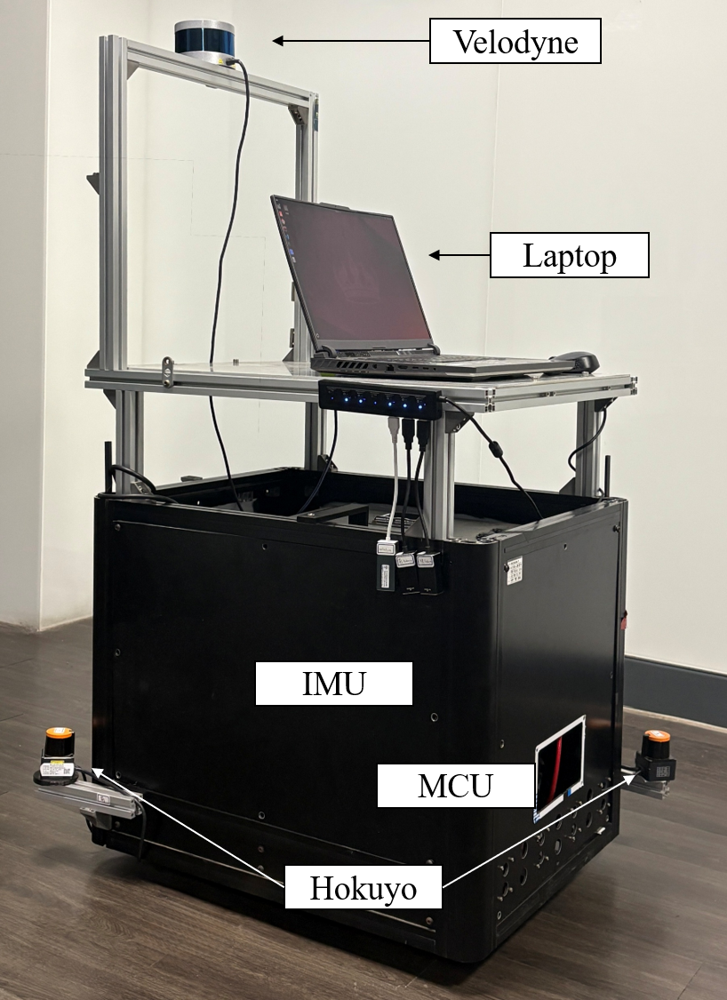

# Autonomous Mobile Robot (AMR) System Based on ROS 2

本專案提出一套基於 ROS 2 Jazzy 架構的自主移動機器人（Autonomous Mobile Robot, AMR）系統，整合 3D LiDAR 與 IMU 進行地圖建構、定位、路徑規劃與運動控制，並透過 2D LiDAR 實現動態障礙物偵測與避障，應用於室內導航任務。

在定位方面，系統採用 DLIO（LiDAR-Inertial Odometry）進行高頻姿態估測，並結合 AMCL 以補償累積誤差。在路徑規劃與控制方面，分別比較了 A* 與 Theta* 演算法，以及 DWB 與 MPPI 控制器。最終選用 Theta* 搭配 MPPI，實驗顯示可實現更平滑的軌跡與穩健的避障控制能力。

系統於兩組不同導航任務中進行驗證，包含 38 公尺動態障礙路徑與 185 公尺長距離走廊導航。結果顯示平均位置誤差小於 5.1 公分，角度誤差小於 3.5 度，具備良好的重複性與一致性。

---

## Hardware Configuration

- 3D LiDAR: Velodyne VLP-16 Puck
- 2D LiDARs: Hokuyo x2 (diagonally mounted for 360° scanning)
- IMU: CH110
- Microcontroller: OpenCR (with micro-ROS support)

<div align="left">


</div>

## Software Architecture

### Core Functionalities 

- Mapping: DLIO
- Localization: AMCL + DLIO odometry
- Path Planning: Theta* (global planner)
- Controller: MPPI (Model Predictive Path Integral) controller

### Using packages

- Mechatronic System:
    - [velodyne](https://github.com/ros-drivers/velodyne/tree/ros2)
    - [urg_node2](https://github.com/Hokuyo-aut/urg_node2)
    - [ira_laser_tools](https://github.com/nakai-omer/ira_laser_tools/tree/humble)
    - [micro_ros_arduino](https://github.com/micro-ROS/micro_ros_arduino/tree/jazzy)
    - [micro-ROS-agent](https://github.com/micro-ROS/micro-ROS-Agent/tree/jazzy)
    - [micro_ros_msgs](https://github.com/micro-ROS/micro_ros_msgs/tree/jazzy)
    - [serial_imu](https://sealandtech.com.tw/resource.html?s=anrot&type=tutorial&p=ros2/readme)
- Mapping:
    - [DLIO](https://github.com/vectr-ucla/direct_lidar_inertial_odometry/tree/feature/ros2)
- Localization:
    - AMCL
    - [DLIO](https://github.com/vectr-ucla/direct_lidar_inertial_odometry/tree/feature/ros2)
- Navigation2:
    - 2d map : [pointcloud_to_2dmap_ros](https://github.com/m11312045/pointcloud_to_2dmap_ros/tree/ros2)
    - local planner : MPPI
    - global planner : theta*

### Chassis control

1. OpenCR reads encoder signals from both wheels.
2. Receives /cmd_vel from the ROS 2 navigation stack.
3. Converts central velocity commands into left/right wheel speeds using differential drive kinematics (not Ackermann).
4. Applies PID control for velocity tracking and sends PWM signals to the motors.


## Launch command

### Mechatronics system

main (sencor + tf + chassic)
```bash
cd ~/ros2_ws/
source install/setup.bash
ros2 launch scl_amr mechatronics.launch.py
```

keyboard control
```bash
ros2 run teleop_twist_keyboard teleop_twist_keyboard
```

TF + sensor
```bash
cd ~/ros2_ws/
source install/setup.bash
ros2 launch scl_amr sensor.launch.py
```

encoder data
```bash
ros2 topic echo /encoder_right
ros2 topic echo /encoder_left
ping 192.168.0.10
ping 192.168.1.11
```

only TF
```bash
cd ~/ros2_ws/
source install/setup.bash
ros2 launch scl_amr AMR_model.launch.py
```

### Off-Line SLAM

#### Record baf file
```bash
cd ~/ros2_ws/src/scl_amr/bagfile/
ros2 bag record -a -o b1_2rounds_no_vehivle
```

#### DLIO SLAM
```bash
# bag 
cd ~/ros2_ws/src/scl_amr/bagfile/
ros2 bag play b1_2rounds_no_vehivle

# slam
cd ~/ros2_ws/
source install/setup.bash
ros2 launch scl_amr dlio.launch.py

# save pcd
cd ~/ros2_ws/
source install/setup.bash
ros2 service call /save_pcd direct_lidar_inertial_odometry/srv/SavePCD "{'leaf_size': 0.1, 
'save_path': '/home/scl/ros2_ws/src/scl_amr/map/'}"

# pcd view
pcl_viewer ~/ros2_ws/src/scl_amr/map/dlio_map.pcd

# pointcloud_to_2dmap_ros2
ros2 launch pointcloud_to_2dmap_ros2 pointcloud_to_2dmap.launch.py
```

#### pcl_viewer
```bash
# install
apt-get install pcl-tools
# view
pcl_viewer map.pcd
```

#### Bag file
- [LIO-SAM](https://drive.google.com/drive/folders/1gJHwfdHCRdjP7vuT556pv8atqrCJPbUq)
- [hdl_graph_slam](https://zenodo.org/records/6960371)
- [fast-lio](https://drive.google.com/drive/folders/1blQJuAB4S80NwZmpM6oALyHWvBljPSOE)

### Navigation

#### Nav2 
```bash
cd ~/ros2_ws/
source install/setup.bash
ros2 launch scl_amr mechatronics.launch.py

cd ~/ros2_ws/
source install/setup.bash
ros2 launch scl_amr dlio.launch.py

cd ~/nav2_ws/
source install/setup.bash
cd ~/ros2_ws/
source install/setup.bash
ros2 launch scl_amr navigation_bringup_launch.py

cd ~/nav2_ws/
source install/setup.bash
cd ~/ros2_ws/
source install/setup.bash
ros2 launch scl_amr single_navigate_and_log.launch.py mode:=1

cd ~/nav2_ws/
source install/setup.bash
cd ~/ros2_ws/
source install/setup.bash
ros2 launch scl_amr multi_navigate_and_log.launch.py log_csv:=5.csv
```

#### Clear global costmap
```bash
ros2 service call /global_costmap/clear_entirely_global_costmap nav2_msgs/srv/ClearEntireCostmap "{}"
```

#### Clear local costmap
```bash
ros2 service calllocal_costmap/clear_entirely_local_costmap nav2_msgs/srv/ClearEntireCostmap "{}"
```

#### rviz update
```bash
cp /home/scl/ros2_ws/install/scl_amr/share/scl_amr/rviz/nav2_scl.rviz /home/scl/ros2_ws/src/scl_amr/rviz/
```

#### Map server
```bash
rviz2
# add map topic, add topic name 'map'

ros2 launch scl_amr map.launch.py

# ros2 run nav2_map_server map_server --ros-args --params-file ~/ros2_ws/src/scl_amr/config/map_server_params.yaml

# ros2 lifecycle set /map_server configure
# ros2 lifecycle set /map_server activate
```

#### AMCL localization
```bash
ros2 launch scl_amr mechatronics.launch.py

ros2 launch rf2o_laser_odometry rf2o_laser_odometry.launch.py

rviz2

ros2 launch nav2_bringup localization_launch.py
然後要拉 2D pose estimate
```

### Commonly used command
#### Compile workspace
```bash
rosdep install --from-paths src --ignore-src -r -y --rosdistro jazzy
colcon build --symlink-install
source install/setup.bash
```

#### Source workspace
```bash
source ~/nav2_ws/install/setup.bash
source ~/ros2_ws/install/setup.bash
```

#### Dependency Updates
```bash
rosdep update
rosdep install --from-paths src --ignore-src -r -y --rosdistro jazzy
```

#### About tf
```bash
ros2 run rqt_tf_tree rqt_tf_tree --force-discover

ros2 run tf2_ros tf2_echo map odom 
```